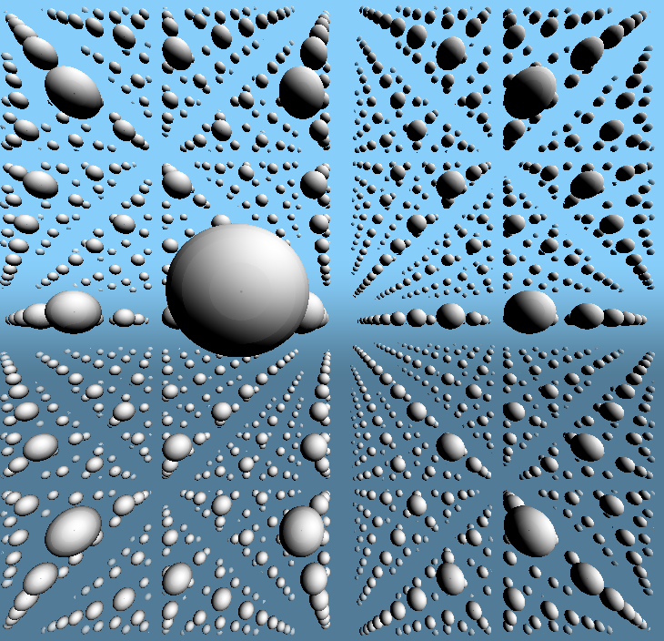

#What is this?

A glsl shader that uses ray marching with space folding to render
lots of spheres. The `run.sh` script runs the shader.

See what is ray marching [here](https://en.wikipedia.org/wiki/Ray_marching).

